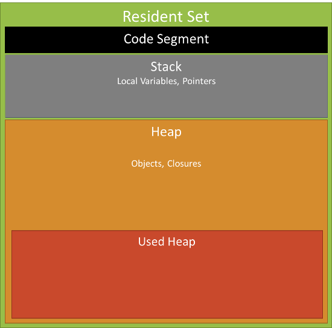

# 三.分配内存

## 1.2 v8 内存管理

### 1.2.1 v8 内存限制

- 在 64 位操作系统可以使用 1.4G 内存
- 在 32 位操作系统可以使用 0.7G 内存

### 1.2.2 v8 内存管理

- js 对象都是通过 v8 进行分配管理内存的
- process.memoryUsage 返回一个对象，包含了 Node 进程的内存占用信息



- rss(resident set size):所有内存占用，包括指令区和堆栈

* heap Tatal:"堆"占用的内存，包括用到的和没用到的
* heapUsed：用到的堆的部分。判断内存泄漏，以 headUsed 字段为准

* external:V8 引擎内部的 C++对象占用的内存
  

## 为何限制内存大小

#### 因为 V8 垃圾收集工作原理导致的，1.4G 内存完成一次垃圾收集需要 1 秒以上

#### 这个暂停时间成为 Stop The Word，在这个期间，应用性能和响应能力都会下降

## 如何打开内存限制

### 一旦初始化成功，生效后不能再修改

### -max-new-space-size,最大 new space 大小，执行 scavenge 回收，默认 16M，单位 KB

```
node --max-old-space-size=2000 app.js 单位是M
```

### -max-old-space-size，最大 old sapce 大小，执行 MarkSweep 回收，默认 1G，单位 MB

```
node --max-new-space-size=1024 app.js单位是kb
```
