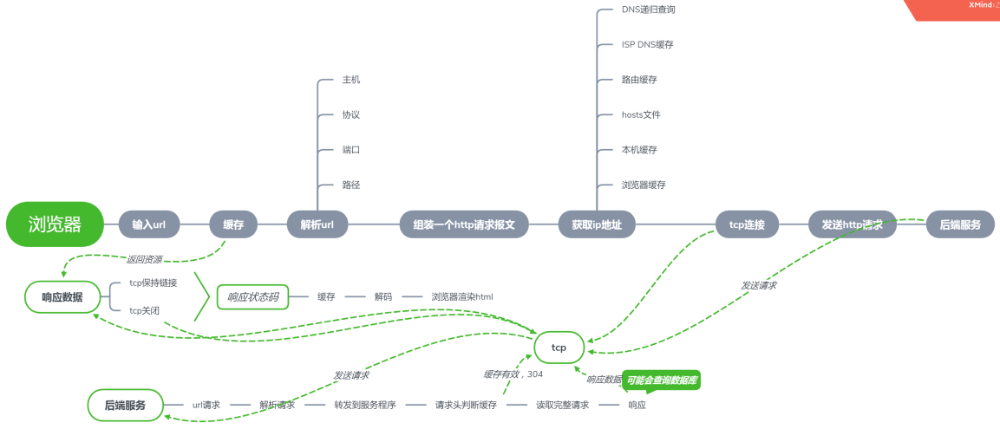

# 浏览器底层渲染机制

相关示例图

从浏览器地址栏输入 url 到显示页面的步骤

- 输入 url
- 查找是否有 url 缓存，如果有缓存并且缓存新鲜就通过缓存拿到 ip 地址，否则请求 dns 服务器拿到 ip 地址
- 解析 url 得到协议、主机、端口、path
- 组装成 http 请求报文
- 打开一个 sockit 与 ip 进行三次握手
- 将组装好的请求报文发送给后端
- 服务端解析请求，调用相关服务程序
- 相关服务程序解析请求头，如果有缓存信息判断缓存是否有效，如果有效直接返回 304，没有效果就查询相关数据，期间可能会查询数据库，返回数据给客户端
- 服务根据需要选择保持 tcp 链接或者关闭 tcp 连接
- 如果关闭 tcp 链接，进行四次挥手
- 客户端拿到请求信息后解析请求，缓存相关内容，如果是 gzip 压缩的内容需要转码
- 浏览器根据文件类型解析相关文件
- [如果是 html 文件，浏览器进入解析 html 的逻辑](//source/browser/2.tree.html)

## ip 地址解析

## tcp 的三次握手与四次挥手

## 浏览器的相关缓存
